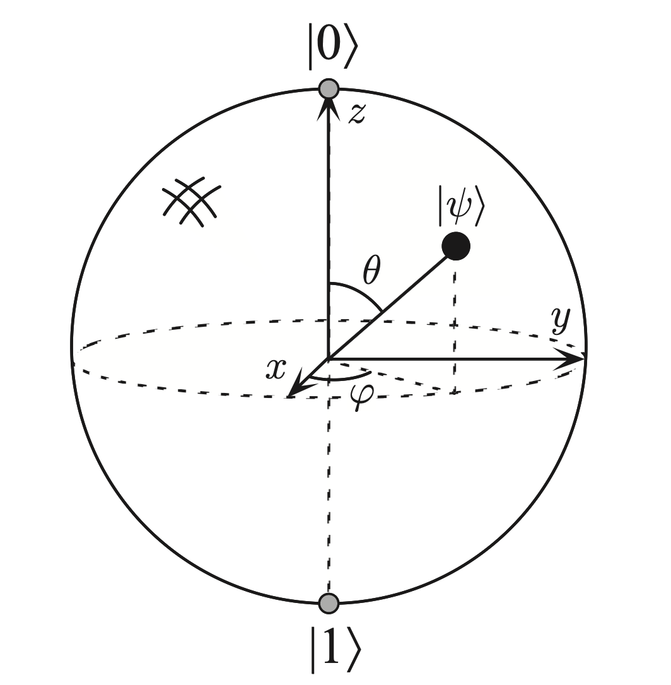

# 量子计算入门

## 背景介绍
~~本人的量子计算知识已经还给老师了，如有错误请指出，不影响做题~~

在经典计算中我们使用比特来表示信息，在量子计算中也有对应的概念，称为量子比特（qubit）。我们使用布洛赫球（Bloch sphere）来可视化单个qubit的状态和相关的计算。单个qubit可以表示为一个单位球面上的点，如下图所示:



其中$\ket{0}$和$\ket{1}$是常见的一组基，也就是说我们可以将单个qubit表示为它们的线性组合
$\ket{\psi} = \alpha \ket{0} + \beta \ket{1}$，其中$\alpha$和$\beta$是复数，满足归一化条件$|\alpha|^2 + |\beta|^2 = 1$。

在介绍完qubit后，我们开始定义量子门（quantum gate）。量子门是对qubit进行操作的基本单元。在理想条件下，我们将作用在单比特上的量子门表示为一个2x2的酉矩阵。常见的量子门包括Hadamard门、Pauli-X门、Pauli-Y门、Pauli-Z门等。XYZ门可以视为在Bloch球上绕X、Y、Z轴逆时针旋转。下面给出各操作对应的矩阵表示：

| 门类型 | 矩阵表示 |
| --- | --- |
| Hadamard门 | $H = \frac{1}{\sqrt{2}} \begin{bmatrix} 1 & 1 \\ 1 & -1 \end{bmatrix}$ |
| Pauli-X门 | $X = \begin{bmatrix} 0 & 1 \\ 1 & 0 \end{bmatrix}$ |
| Pauli-Y门 | $Y = \begin{bmatrix} 0 & -i \\ i & 0 \end{bmatrix}$ |
| Pauli-Z门 | $Z = \begin{bmatrix} 1 & 0 \\ 0 & -1 \end{bmatrix}$ |
| Phase门 | $S = \begin{bmatrix} 1 & 0 \\ 0 & i \end{bmatrix}$ |

例如，在对$\ket{0}$应用Hadamard门后，我们得到
$H\ket{0} = \frac{1}{\sqrt{2}}(\ket{0} + \ket{1})$。

然后我们可以将多个量子门组合起来进行更复杂的操作。最后，我们需要对其量子态进行测量以获取最终结果（qubit->经典bit）。在量子计算机上我们会多次运行量子线路以采样获得测量结果的分布。这一操作可以视为对量子态的投影，我们可以以在$\ket{0}$和$\ket{1}$为基，将其转换为$\ket{\psi} = \alpha \ket{0} + \beta \ket{1}$后，观测结果为0的概率为$|\alpha|^2$。注意这里的$\alpha$和$\beta$都是复数，也就是说相位信息被擦除了，感兴趣的同学可以自行了解量子傅立叶变换及其经典应用量子相位估计。

## 题目描述
本题给出一个单qubit上的量子线路，给定初态$\ket{0}$，模拟整个量子线路，计算最终测量前的量子态并以$\ket{0}$和$\ket{1}$的线性组合表示（~~这里不求测量0的概率以防有人混水摸鱼~~）。

你需要实现一个C++函数，对应签名如下：
```cpp
/// \param N 量子门的数量，保证是2的幂
/// \param Gates 量子门的字符串表示，长度为N。每个字符表示一个量子门，只可能为'H', 'X', 'Y', 'Z', 'S'中的一个，分别表示Hadamard门、Pauli-X门、Pauli-Y门、Pauli-Z门和Phase门。
/// \param Alpha 输出参数，表示最终量子态的系数$\alpha$
/// \param Beta 输出参数，表示最终量子态的系数$\beta$
void simulate(size_t N, const char *Gates, std::complex<double> &Alpha, std::complex<double> &Beta) {
  ...
}
```

将该文件命名为`simulate.cpp`，评测时会将其与`driver.o`中的入口函数`main`进行编译链接：
```bash
icpx -std=c++17 -qopenmp -O3 simulate.cpp driver.o -o simulate
```
`main`函数会负责读取输入并调用`simulate`函数，然后输出结果与运行时间。你只需要实现`simulate`函数。请不要尝试hack `driver.o`，最终评测使用的`driver.o`与提供的预构建二进制文件不同。

该题还提供了生成测试用例的程序`gen.cpp`，你可以使用以下命令生成测试用例：
```bash
g++ -O3 gen.cpp -o gen
./gen N input.bin
```
然后运行`simulate`程序来测试你的实现：
```bash
./simulate input.bin
```

## 评分标准
由于最终答案的概率只有几种可能，为了防止大家猜答案，程序会在多组输入下进行正确性验证，若任一输入对应的结果不正确，该题不得分。

## 备注
1. 参考书籍：Quantum Computation and Quantum Information, Michael A. Nielsen, Isaac L. Chuang
2. 这些量子门的组合有一些特殊的性质，比如HH=I，HXH=Z等。本题允许利用更多量子计算的知识进行加速，但这些不是本题的考察点，即保证不利用这些性质也能拿到满分。
3. 希望大家思考一下如何利用CPU的并行计算能力，想到这一步就有基础分数了。
4. 结果保留到小数点后12位。中间过程避免使用浮点数进行计算，否则可能会因为精度问题导致错误的结果。该题的例程已提供了一个基于符号的计算框架。
